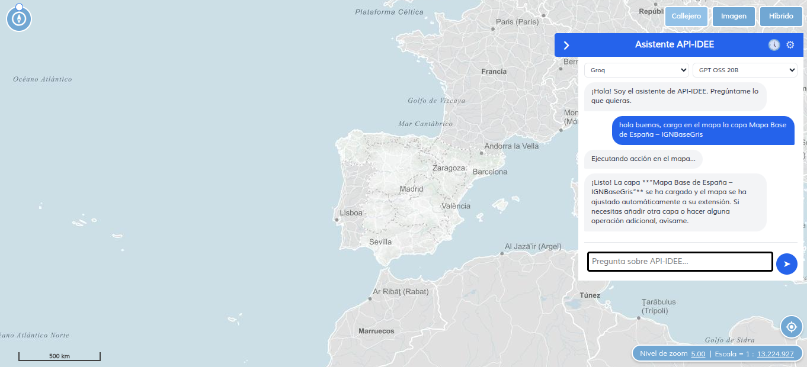
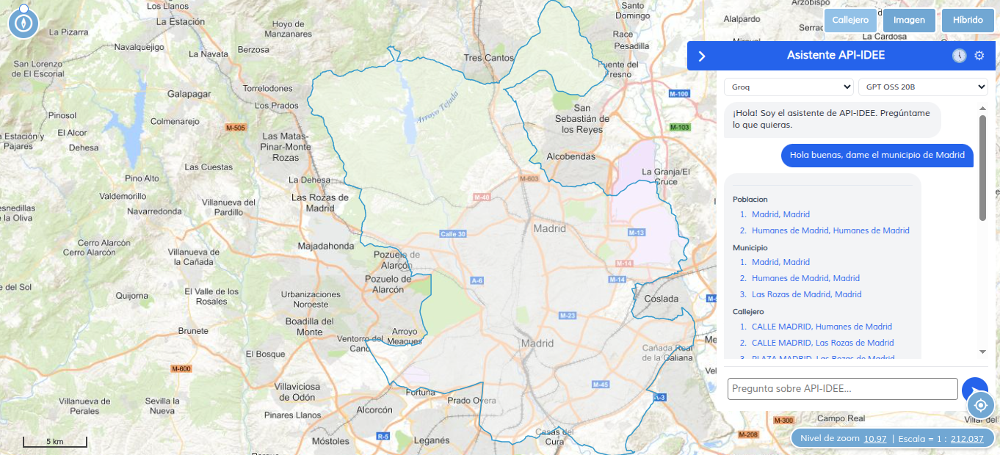
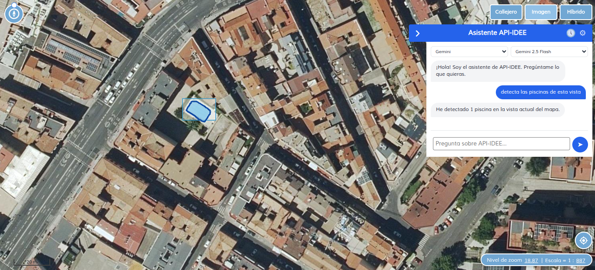

# API-IDEE Agent

Agente IA para el visualizador de mapas [API-IDEE](https://github.com/Desarrollos-IDEE/API-IDEE). Combina un servidor Django con RAG (Retrieval-Augmented Generation) y un plugin nativo del visualizador que permite interactuar con el mapa mediante chat.

---

> **Prompt:** Hola buenas, carga en el mapa la capa Mapa Base de España – IGNBaseGris



> **Prompt:** Hola buenas, dame el municipio de Madrid



> **Prompt:** Detecta las piscinas de la vista



---

## Arquitectura

```
                        Plugin JS (navegador)
                     ┌──────────────────────────┐
                     │  Chat UI  ←→  TOOL_MAP   │
                     │         ↕     ↕          │
                     │      IDEE.Map (OL/Cesium)│
                     └───────────┬──────────────┘
                                 │ REST
                     ┌───────────▼──────────────┐
                     │   Servidor Django         │
                     │                           │
                     │  Agent ← Skills + Tools   │
                     │    ↕         ↕             │
                     │  LLM    RAG (FAISS)       │
                     └───────────────────────────┘
```

## Conceptos clave (teoría)

### Agent

Un **agente** es un programa que percibe su entorno, razona sobre ello y ejecuta acciones para lograr un objetivo. A diferencia de un simple "LLM call", un agente:

1. **Recibe entrada** — el mensaje del usuario y el estado actual del mapa
2. **Busca contexto** — consulta RAG para obtener información relevante (código fuente, documentación)
3. **Razona** — construye un prompt con skills activos + contexto + estado y llama al LLM
4. **Decide** — el LLM puede responder texto o solicitar la ejecución de una tool
5. **Itera** — si se ejecutó una tool, el agente procesa el resultado y genera una respuesta final

El agente **no ejecuta las tools** directamente, solo decide cuál invocar. La ejecución ocurre en el navegador. Esto sigue el patrón **"el agente piensa, el plugin actúa"**.

```
Mensaje usuario
     │
     ▼
┌──────────┐   ┌────────┐   ┌──────┐
│ Buscar   │──▶│ LLM    │──▶│Text  │──▶ Respuesta
│ contexto │   │+ tools │   │o tool│
│ (RAG)    │   │        │   │_call │
└──────────┘   └────────┘   └──┬───┘
                               │ tool_call
                               ▼
                         ┌──────────┐   ┌────────┐
                         │ Plugin   │──▶│ LLM    │──▶ Texto final
                         │ ejecuta  │   │procesa │
                         │ tool     │   │result. │
                         └──────────┘   └────────┘
```

Ubicación: `servidor/agent/agent.py`

### Tool

Una **tool** es una acción atómica que el agente puede invocar. Cada tool tiene:

- **Nombre** — identificador único (ej: `zoomTo`)
- **Descripción** — texto que el LLM lee para entender cuándo usarla
- **Parámetros** — esquema JSON con los argumentos que necesita

Las tools se definen en JSON en el servidor y se implementan en JavaScript en el plugin. El LLM nunca ejecuta la tool directamente; solo genera una solicitud de llamada (tool_call) con los argumentos adecuados. El plugin recibe la solicitud, ejecuta la tool sobre el mapa real, y devuelve el resultado al servidor.

```
LLM decide usar tool
       │
       ▼
tool_call { name: "zoomTo", args: { lat: 40.4, lon: -3.7 } }
       │
       ▼
Plugin ejecuta: map.setCenter({ x: -3.7, y: 40.4 })
       │
       ▼
Devuelve { success: true }
       │
       ▼
LLM procesa resultado y responde al usuario
```

Una tool es como una **función** que el agente puede "llamar" pero que ejecuta otro sistema. No hay lógica en el servidor para la tool — solo la definición de su interfaz.

**Dónde vive**: Definición en `servidor/agent/tools/definitions/*.json`, implementación en `plugin/chatagent.js` (CHATAGENT_TOOL_MAP).

### Skill

Un **skill** es conocimiento de dominio que agrupa:

1. **Un conjunto de tools** relacionadas
2. **Un prompt especializado** que le dice al LLM *cómo* y *cuándo* usarlas

Mientras que una tool solo dice "qué hace", un skill dice "cómo usarla bien". Por ejemplo, el skill `navigation` incluye:

```yaml
tools: [getMapCenter, getCurrentZoom, zoomTo, setZoom]
prompt: |
  Cuando el usuario quiera navegar:
  1. Usa getMapCenter() para saber donde esta
  2. Usa zoomTo(lat, lon, zoom) para mover el mapa
  Siempre confirma lo que hiciste.
```

Los skills se inyectan en el system prompt del LLM, por lo que actúan como **instrucciones contextuales** que mejoran la calidad de las respuestas sin necesidad de fine-tuning.

A diferencia de las tools (que son puramente mecánicas), los skills codifican **buenas prácticas** y **flujos de trabajo** específicos del dominio.

**Dónde vive**: `servidor/agent/skills/definitions/*.yaml`

### Embedding

Un **embedding** es una representación numérica de texto en forma de vector (lista de números). La idea clave es:

- Textos con significado similar tienen vectores **cercanos** (distancia pequeña)
- Textos con significado diferente tienen vectores **lejanos** (distancia grande)

Esto permite búsqueda semántica: en vez de buscar por palabras exactas (como `grep`), podemos buscar por **significado**. Por ejemplo, "cómo añado una capa al mapa" y "añadir wms" generan vectores cercanos aunque no compartan palabras.

En el proyecto, los embeddings se usan en el pipeline RAG:

1. **Indexación**: los documentos (código, documentación) se trocean en chunks y cada chunk se convierte a vector con un modelo de embeddings. Los vectores se guardan en FAISS (índice de búsqueda vectorial).
2. **Consulta**: el mensaje del usuario se convierte al mismo tipo de vector. FAISS busca los chunks con vectores más cercanos y los devuelve como contexto para el LLM.

El proyecto soporta tres tipos de embeddings:

| Tipo | Modelo por defecto | Requisito | Uso recomendado |
|------|--------------------|-----------|-----------------|
| Local (FastEmbed) | `BAAI/bge-m3` (multilingüe) | Ninguno (descarga ~80MB) | Offline, privacidad total |
| OpenAI | `text-embedding-3-small` | API key de OpenAI | Alta calidad, ingles |
| Gemini | `models/embedding-001` | API key de Google | Alta calidad, multilingue |

El modelo por defecto es **local** con `BAAI/bge-m3`, un modelo multilingüe gratuito que funciona bien con español. El resultado de `get_embeddings()` se **cachea** para evitar recrear el modelo en cada petición.

**Dónde vive**: `servidor/agent/rag/embeddings.py`

### MCP (Model Context Protocol)

**MCP** (Model Context Protocol) es un protocolo abierto creado por Anthropic que estandariza cómo los modelos de IA se conectan con herramientas y fuentes de datos externas. Piensa en él como un "USB-C para la IA": define una interfaz universal donde servidores MCP exponen tools, recursos y prompts mediante JSON-RPC.

En este proyecto, MCP convive con el sistema de tools nativo:

- **Tools del mapa** (nativas): se definen en `tools/definitions/*.json`, se ejecutan en el navegador vía el plugin JS.
- **Tools MCP** (externas): se descubren automáticamente vía `tools/list` al arrancar el servidor, se ejecutan en el servidor vía JSON-RPC.

El LLM no distingue el origen de una tool — solo ve su nombre, descripción y parámetros. Cuando el LLM decide llamar a una tool MCP, el agente la ejecuta directamente en el servidor, realimenta el resultado al LLM y continúa la conversación en un bucle. Las tools del mapa se siguen devolviendo al frontend como antes.

```
LLM decide usar tool
       │
       ▼
tool_call { name: "get_weather", args: { city: "Madrid" } }
       │
       ▼
┌─ ¿Es MCP? ─────────────────────────────┐
│ Sí → Servidor ejecuta via JSON-RPC      │
│      │                                  │
│      ▼                                  │
│ Resultado → se realimenta al LLM        │
│      │                                  │
│      ▼                                  │
│ LLM responde texto o nuevos tool_calls   │
└─────────────────────────────────────────┘
       │
       ▼
┌─ ¿Es del mapa? ────────────────────────┐
│ Sí → Se devuelve al plugin JS           │
│      (como siempre)                     │
└─────────────────────────────────────────┘
```

Las tools MCP son ideales para operaciones que no requieren el mapa: consultar APIs externas, bases de datos, sistemas de ficheros, etc.

**Dónde vive**: `servidor/agent/mcp/` — configuración en `mcp_servers.json`

### Resumen visual de las relaciones

```
SKILL (YAML)                 TOOL (JSON)                AGENT (Python)
┌──────────────────┐       ┌──────────────────┐       ┌──────────────────┐
│ navigation        │       │ zoomTo {         │       │ Agent.run()       │
│ tools:            │──────▶│   lat, lon, zoom │       │  1. RAG context   │
│   - zoomTo        │       │ }                │       │  2. Skills prompt │
│   - setZoom       │       ├──────────────────┤       │  3. LLM call      │
│   - getMapCenter  │       │ setZoom {        │       │  4. tool_call?    │
│ prompt: |         │──────▶│   level          │       └──────────────────┘
│   "Instrucciones  │       │ }                │              │
│    para navegar"  │       ├──────────────────┤              ▼
└──────────────────┘       │ getMapCenter {}   │      ┌──────────────────┐
                            └──────────────────┘      │ PLUGIN (JS)      │
                                                       │ CHATAGENT_TOOL_MAP│
                                                       │   zoomTo: fn()    │
                                                       │   setZoom: fn()   │
                                                       └──────────────────┘

EMBEDDINGS (modelo)          FAISS (indice)
┌──────────────────┐       ┌──────────────────┐
│ "texto" ──▶ [0.1, │       │  Chunk 1: vector A│
│             0.3,  │──────▶│  Chunk 2: vector B│
│             0.8]  │       │  Chunk 3: vector C│
└──────────────────┘       └──────────────────┘
                                  │
                                  ▼
                          ┌──────────────────┐
                          │ retrieve_context  │  ← Consulta: embedding del mensaje
                          │ Devuelve top-k    │
                          │ chunks similares  │
                          └──────────────────┘
```

## Arquitectura: cómo se conectan Agent, Skills, Tools, Embeddings

```
                    ┌──────────────────────────────────────┐
                    │            USUARIO (Chat)             │
                    └──────────────┬───────────────────────┘
                                   │
                    ┌──────────────▼───────────────────────┐
                    │              AGENT                    │
                    │        (servidor/agent/agent.py)      │
                    │                                      │
                    │  1. Recibe el mensaje del usuario     │
                    │  2. Consulta RAG para contexto        │
                    │  3. Construye system prompt con:      │
                    │     - Prompt base                     │
                    │     - Skills activos (tools + prompt) │
                    │     - Contexto RAG                    │
                    │     - Estado del mapa                 │
                    │  4. Llama al LLM con tools disponibles│
                    │  5. Devuelve texto o tool_call        │
                    └────┬─────────┬──────────┬────────────┘
                         │         │          │
                         │         │          │
          ┌──────────────▼──┐ ┌───▼────────┐ │
          │     RAG         │ │   LLM      │ │
          │ (contexto       │ │ (Gemini /  │ │
          │  semantico)     │ │  OpenAI)   │ │
          │                 │ │            │ │
          │  FAISS stores   │ │            │ │
          │  (cacheadas)    │ │            │ │
          │  ↑              │ │            │ │
          │  Embeddings     │ │            │ │
          │  (local/API)    │ │            │ │
          │  (cache)        │ │            │ │
          └─────────────────┘ └────────────┘ │
                                             │
                         ┌───────────────────▼──────────┐
                         │        TOOLS (plugin JS)      │
                         │  Ej: zoomTo, addWMSLayer, ... │
                         │  Se ejecutan en el navegador  │
                         └──────────────────────────────┘
```

### Flujo detallado

1. **Skills** → definen herramientas + contexto de uso. Ej: el skill `navigation` agrupa `zoomTo`, `getMapCenter` y da instrucciones al LLM sobre cómo navegar.

2. **Tools** → acciones atómicas definidas en JSON (servidor) e implementadas en JS (plugin). El LLM decide cuál invocar según la petición del usuario.

3. **RAG (Embeddings + FAISS)** → los documentos se trocean en chunks, se convierten a vectores con un modelo de embeddings y se guardan en FAISS. En cada consulta, el mensaje del usuario se convierte al mismo tipo de vector y se buscan los chunks más similares. Las stores FAISS y los modelos de embeddings se **cachean en memoria** para evitar recargarlos en cada petición.

4. **Agent** → orquesta todo: recibe el mensaje, pide contexto a RAG, inyecta los skills activos y el estado del mapa en el prompt, llama al LLM, y si el LLM devuelve un tool_call, lo reenvía al plugin para ejecutarlo.

### Dónde se configura cada pieza

| Pieza | Configuración | Proveedores |
|-------|--------------|-------------|
| **LLM** | `LLM_PROVIDER` + `LLM_MODEL` en `.env`, o API key propia desde el plugin | Gemini, OpenAI (y cualquier proveedor compatible con API OpenAI via `providers.json`) |
| **Embeddings** | `EMBEDDINGS_PROVIDER` + `EMBEDDINGS_MODEL` en `.env` | Local (FastEmbed, default `BAAI/bge-m3`), OpenAI, Gemini |
| **Tools** | JSON en `servidor/agent/tools/definitions/` | Autodescubiertos al arrancar |
| **Skills** | YAML en `servidor/agent/skills/definitions/` | Autodescubiertos al arrancar |
| **RAG** | `index_source` CLI + `VECTORSTORE_DIR` en `.env` | FAISS + embeddings (cacheados en memoria) |

## Requisitos

- Una API key de un proveedor LLM:
  - [Google Gemini](https://aistudio.google.com/app/apikey) (gratuita)
  - [OpenAI](https://platform.openai.com/api-keys)
  - Cualquier proveedor compatible con API OpenAI (Groq, Cerebras, OpenRouter, etc.)

### Con Docker (recomendado)

- [Docker](https://docs.docker.com/get-docker/) y [Docker Compose](https://docs.docker.com/compose/install/)

### Sin Docker

- Python 3.11+
- Git

## Instalación con Docker

```bash
# 1. Clonar
git clone https://github.com/IngenieroGeomatico/apiidee-agent.git
cd apiidee-agent

# 2. Configurar
cp servidor/.env.example servidor/.env
# Editar servidor/.env con tu API key

# 3. Arrancar
docker compose up

# 4. Abrir http://localhost:8080
```

Eso es todo. El servidor Django (gunicorn) arranca en el puerto 8000 y el visualizador (nginx) en el 8080. Los modelos ML se descargan automáticamente en el primer arranque.

Para reconstruir tras cambios en el código:

```bash
docker compose up --build
```

### Volúmenes persistentes

| Volumen | Contenido | Propósito |
|---------|-----------|-----------|
| `db_data` | `db.sqlite3` | Base de datos de conversaciones |
| `ml_models` | `pool_detector.onnx` | Pesos del modelo ML (se descargan una vez) |
| `vectorstore_data` | Índices FAISS | Conocimiento indexado para RAG |

## Instalación manual (sin Docker)

### 1. Clonar el repositorio

```bash
git clone https://github.com/IngenieroGeomatico/apiidee-agent.git
cd apiidee-agent
```

### 2. Configurar el servidor

```bash
cd servidor

# Crear entorno virtual
python -m venv .venv

# Activar entorno virtual
# Windows:
.venv\Scripts\activate
# Linux/Mac:
source .venv/bin/activate

# Instalar dependencias
pip install -r requirements.txt

# Configurar variables de entorno
cp .env.example .env
# Editar .env con tu API key (ver seccion Configuracion)

# Crear base de datos
python manage.py migrate

# Arrancar servidor
python manage.py runserver
```

### 3. Servir el visualizador

En otra terminal, desde la raíz del proyecto:

```bash
python -m http.server 8080
```

### 4. Abrir el visualizador

Navegar a `http://localhost:8080/index.html`

## Desarrollo

Si vas a contribuir código, instala las dependencias de desarrollo y activa los
git hooks. Esto ejecuta [ruff](https://docs.astral.sh/ruff/) (linter + formateador)
automáticamente en cada commit, arreglando lo que puede y bloqueando el commit
si quedan errores.

```bash
cd servidor

# Instalar dependencias de dev (incluye ruff y pre-commit)
pip install -r requirements-dev.txt

# Enganchar los git hooks (solo una vez por clon)
pre-commit install
```

> **Importante**: `pre-commit install` hay que ejecutarlo manualmente una vez por
> clon. Git no permite versionar los hooks (`.git/hooks/`), así que este paso no
> puede automatizarse; el `.pre-commit-config.yaml` (raíz del repo) solo define
> *qué* hooks se ejecutan.

Comandos útiles:

```bash
# Pasar los hooks sobre TODO el codigo (util la primera vez)
pre-commit run --all-files

# Ejecutar ruff manualmente
ruff check servidor            # listar problemas
ruff check servidor --fix      # arreglar automaticamente
ruff format servidor           # formatear

# Actualizar la version de los hooks
pre-commit autoupdate

# Saltar los hooks en un commit puntual (usar con moderacion)
git commit --no-verify
```

Las reglas de ruff viven en `ruff.toml` (raíz del repo).

## Configuración

Editar `servidor/.env`:

```env
# --- Proveedor LLM ---

# Opcion A: Google Gemini (gratuita)
LLM_PROVIDER=gemini
LLM_MODEL=gemini-pro
GOOGLE_API_KEY=AIza...

# Opcion B: OpenAI
LLM_PROVIDER=openai
LLM_MODEL=gpt-4o-mini
OPENAI_API_KEY=sk-...

# --- Django ---
SECRET_KEY=cambia-esto-por-una-clave-secreta
DEBUG=True

# --- CORS ---
ALLOWED_ORIGINS=http://localhost:8080,http://localhost:3000

# --- Embeddings (opcional, por defecto local) ---
EMBEDDINGS_PROVIDER=local
EMBEDDINGS_MODEL=BAAI/bge-m3
```

### API keys desde el plugin (claves de usuario)

El usuario puede guardar sus propias API keys directamente desde el chat, con **nombre personalizado**. Las keys se guardan exclusivamente en el **navegador (localStorage)** y persisten entre sesiones. Nunca se almacenan en el servidor.

#### Cómo funciona

1. Haz clic en el icono de **engranaje (⚙)** en la cabecera del chat
2. Se abre el panel de configuración con las claves guardadas y el formulario para añadir nuevas
3. Para guardar una clave:
   - Escribe un **nombre personalizado** (ej: "Mi API de Groq", "Producción", "Test")
   - **Selecciona el proveedor** del desplegable (los disponibles en el servidor)
   - Introduce tu **API key**
   - Haz clic en **Probar** — el servidor verifica la key contra el proveedor (`GET {base_url}/models`)
   - Si la key es válida, haz clic en **Guardar**
4. Las claves guardadas aparecen listadas con el nombre, proveedor y key parcialmente oculta
5. Para eliminar una clave, haz clic en **×** a la derecha

> El botón **Guardar** solo se activa tras pulsar **Probar** y recibir validación correcta.

#### Selección en la barra superior

Las claves guardadas aparecen como opciones seleccionables en el desplegable de proveedores de la barra superior, separadas de los proveedores del servidor por una línea `─── Tus claves ───`. Cada entrada se muestra con un icono 🔑 y su **nombre personalizado**. Al seleccionar una:

- Su `api_key` se envía automáticamente con cada mensaje y resultado de tool
- El proveedor subyacente se usa para cargar los modelos disponibles
- El campo `api_key` solo viaja en memoria durante la petición HTTPS — **no se almacena en la base de datos del servidor** ni en logs

Puedes tener múltiples entradas para un mismo proveedor con distintas keys y nombres.

Puedes usar cualquier proveedor compatible con la API de OpenAI (Groq, Cerebras, OpenRouter, etc.) que esté configurado en el servidor a través de `providers.json`.

## Indexar conocimiento (RAG)

El agente necesita conocimiento para responder. Usa el comando `index_source` para indexar repositorios git o documentación web:

```bash
cd servidor

# Indexar un repositorio git
python manage.py index_source https://github.com/Desarrollos-IDEE/API-IDEE --type git

# Indexar documentacion web (crawlea hasta 50 paginas del mismo dominio)
python manage.py index_source https://github.com/Desarrollos-IDEE/API-IDEE/wiki --type web

# Con nombre personalizado
python manage.py index_source https://componentes.idee.es/api-idee/doc/ --type web --name api-idee-docs

# Reducir batch-size si tienes poca RAM (procesa chunks de 50 en 50)
python manage.py index_source https://github.com/Desarrollos-IDEE/API-IDEE --type git --batch-size 50
```

Los índices se guardan en `servidor/vectorstore_data/` (no se suben al repo). Una vez indexados, las stores FAISS se **cachean en memoria** para que las consultas sean rápidas sin recargar de disco.

> **Nota**: `--batch-size` controla cuántos chunks se embeden a la vez. Por defecto 100. Reducirlo baja el consumo de RAM pero ralentiza el proceso.

> **Nota**: Si reindexas una fuente, usa `clear_faiss_cache()` o reinicia el servidor para que los cambios surtan efecto.

## Añadir tools

Los tools son acciones que el agente puede ejecutar en el mapa. Tienen dos partes:

### 1. Definición (servidor)

Crear un fichero JSON en `servidor/agent/tools/definitions/`:

```json
{
  "name": "miNuevoTool",
  "description": "Descripcion de lo que hace (el LLM lee esto para decidir cuando usarlo)",
  "parameters": {
    "type": "object",
    "properties": {
      "param1": { "type": "string", "description": "Descripcion del parametro" }
    },
    "required": ["param1"]
  }
}
```

### 2. Ejecutor (plugin JS)

Añadir la implementación en `plugin/chatagent.js`, dentro de `CHATAGENT_TOOL_MAP`:

```javascript
miNuevoTool: function(map, args) {
    // Llamar a metodos de IDEE.Map
    // ...
    return { success: true, resultado: '...' };
},
```

No hay que tocar Python. El sistema autodescubre los JSON al arrancar.

### Tools disponibles

| Tool | Tipo | Ejecutor | Descripción |
|------|------|----------|-------------|
| `getMapCenter` | Lectura | Frontend | Coordenadas del centro del mapa |
| `getCurrentZoom` | Lectura | Frontend | Nivel de zoom actual |
| `listActiveLayers` | Lectura | Frontend | Lista de capas activas |
| `getMapExtent` | Lectura | Frontend | Bounding box de la vista actual |
| `addLayer` | Escritura | Frontend | Añadir capa al mapa (WMS, WMTS, GeoJSON, etc.) |
| `zoomTo` | Escritura | Frontend | Mover el mapa a coordenadas |
| `removeLayer` | Escritura | Frontend | Eliminar una capa por nombre |
| `setZoom` | Escritura | Frontend | Cambiar nivel de zoom |
| `fetchWebPage` | Lectura | Servidor | Descargar y extraer texto de una página web |
| `geocodePlace` | Lectura | Servidor | Geocodificar un lugar con Cartociudad |
| `searchIdeeService` | Lectura | Servidor | Buscar servicios en el directorio IDEE (paralelo) |
| `listDetectors` | Lectura | Servidor | Listar detectores ML disponibles |
| `detectObjects` | Escritura | Servidor | Ejecutar detector ML sobre zona del mapa |

## Añadir skills

Los skills enseñan al agente cuándo y cómo usar un grupo de tools. Son ficheros YAML.

Crear un fichero en `servidor/agent/skills/definitions/`:

```yaml
name: mi_skill
description: Descripcion del dominio de conocimiento
tools:
  - tool1
  - tool2
  - tool3
prompt: |
  Instrucciones para el LLM sobre como usar estos tools:
  1. Primero haz X
  2. Luego haz Y
  3. Siempre confirma al usuario lo que hiciste
```

No hay que tocar Python. El sistema autodescubre los YAML al arrancar.

### Skills disponibles

| Skill | Tools que usa | Descripción |
|-------|---------------|-------------|
| `navigation` | getMapCenter, getCurrentZoom, getMapExtent, zoomTo, setZoom | Navegar por el mapa y buscar ubicaciones |
| `layer_management` | listActiveLayers, addWMSLayer, removeLayer | Gestionar capas del visualizador |

## Integración MCP

Este proyecto soporta el protocolo MCP (Model Context Protocol) para conectar con servidores externos de herramientas. Las tools MCP se descubren automáticamente, se registran junto a las tools nativas del mapa y se ejecutan en el servidor.

### Cómo agregar un servidor MCP

Las tools del mapa y las MCP conviven sin conflicto. Si una tool MCP tiene el mismo nombre que una existente, se omite con un aviso.

### 1. Copiar el archivo de configuración

```bash
cd servidor
cp mcp_servers.json.example mcp_servers.json
```

### 2. Configurar los servidores MCP

Editar `servidor/mcp_servers.json`:

```json
[
  {
    "name": "mi-servidor",
    "url": "http://localhost:8001",
    "timeout": 30
  }
]
```

| Campo | Descripción |
|-------|-------------|
| `name` | Nombre identificativo del servidor (solo para logs) |
| `url` | Endpoint HTTP donde el servidor MCP acepta JSON-RPC |
| `timeout` | Tiempo máximo de espera en segundos (opcional, por defecto 30) |

### 3. Arrancar el servidor Django

Al iniciar, el sistema se conecta a los servidores MCP configurados, descubre sus tools vía `tools/list` y las registra automáticamente:

```bash
python manage.py runserver
```

Veras en los logs algo como:

```
Connected to MCP server 'mi-servidor' (3 tools)
Registered 3 MCP tools in the tool registry
```

A partir de ahí, el LLM puede invocar las tools MCP como si fueran nativas. No hace falta reiniciar ni tocar código.

### MCP es opcional

Si no configuras servidores MCP, el sistema funciona exactamente igual que antes — el agente simplemente no tiene tools MCP registradas y todo el flujo sigue yendo al frontend. Los tres procesos posibles quedarían así:

| Proceso | Comando | Puerto | Obligatorio |
|---------|---------|--------|-------------|
| Visualizador API-IDEE | `python -m http.server 8080` | 8080 | Recomendado (o abrir `index.html` directamente) |
| Agente Django | `python manage.py runserver` | 8000 | Sí |
| Servidor MCP | `python test_mcp_server.py` | 8001 | Solo si usas MCP |

## Streaming (SSE)

El endpoint `chat/` soporta **streaming opcional** mediante Server-Sent Events (SSE). Cuando se activa, el texto de la respuesta se envía token a token al navegador, en vez de esperar a que el LLM termine toda la respuesta.

### Activar streaming

Añadir `"stream": true` en el body de la petición:

```json
POST /api/conversations/{id}/chat/
{
  "content": "Llevame a Madrid",
  "stream": true
}
```

Si `stream` es `false` o no se incluye, el endpoint se comporta exactamente igual que antes (respuesta JSON completa).

### Formato de eventos SSE

La respuesta es `Content-Type: text/event-stream` con los siguientes eventos:

| Evento | Datos | Descripción |
|--------|-------|-------------|
| `text_delta` | `{"type": "text_delta", "text": "..."}` | Fragmento incremental de texto |
| `tool_call` | `{"type": "tool_call", "toolCalls": [...]}` | Tool calls del mapa para el frontend |
| `sources` | `{"type": "sources", "sources": [...]}` | Fuentes RAG consultadas |
| `layer` | `{"type": "layer", "layer": {...}}` | Capa GeoJSON (detecciones ML) |
| `done` | `{"type": "done"}` | Fin del stream |

### Activar streaming en el plugin

```javascript
const chatAgent = new IDEE.plugin.ChatAgent({
  backendUrl: 'http://localhost:8000/api',
  stream: true,  // Activa streaming SSE
});
```

## Detección de objetos (ML)

El agente incluye un pipeline de detección de objetos sobre imágenes aéreas. Actualmente soporta detección de **piscinas** usando un modelo YOLOv11n fine-tuned (~5 MB ONNX).

### Cómo funciona

1. El LLM decide usar la tool `detectObjects` cuando el usuario lo pide
2. El servidor descarga la imagen de la zona vía WMS (ortofoto PNOA por defecto)
3. Ejecuta el detector ONNX sobre la imagen
4. Devuelve un GeoJSON FeatureCollection con las detecciones
5. El plugin carga el GeoJSON como capa en el mapa

### Modelo

El modelo se descarga y convierte automáticamente al arrancar el servidor:

- **Origen**: [yourkln/pool-detection](https://github.com/yourkln/pool-detection) (YOLOv11n fine-tuned)
- **Formato**: ONNX (~10 MB), se ejecuta con `onnxruntime` (sin PyTorch)
- **Fallback**: Si el modelo no está disponible, usa segmentación por color con OpenCV

```bash
# Descarga manual del modelo
cd servidor
python -m ml_models.download
```

### Detectores disponibles

| Detector | Modelo | Descripción |
|----------|--------|-------------|
| `pool_detector` | YOLOv11n (ONNX) | Detecta piscinas en ortofotos |

Para añadir nuevos detectores, crear una clase en `servidor/agent/ml/detectors/` heredando de `BaseDetector` y decorarla con `@detector`.

## Rendimiento y thread-safety

### Caches thread-safe

Todos los caches del servidor están protegidos con `threading.Lock` para garantizar thread-safety en servidores multihilo:

- **Embeddings**: modelo singleton con double-check locking
- **FAISS stores**: índices cargados una vez desde disco y cacheados en memoria
- **Agent cache**: LRU de hasta 128 entradas por combinación proveedor/modelo/key

### Búsqueda paralela de servicios IDEE

La tool `searchIdeeService` consulta las 6 categorías del directorio IDEE en paralelo usando `ThreadPoolExecutor`, en vez de secuencialmente.

## Historial de conversaciones

Las conversaciones se persisten en el servidor y el plugin las gestiona en el navegador.

### Cómo funciona

- El plugin guarda los IDs de sus conversaciones en `localStorage` (`chatagent_conversations`)
- Al abrir el chat, pide al servidor solo sus conversaciones vía `POST /api/conversations/by-ids/`
- Un panel lateral (icono reloj en el header) muestra el historial con título y fecha
- Click en una conversación la reanuda, cargando sus mensajes
- Botón "Nueva conversación" para empezar de cero

### Límites configurables

| Variable | Default | Descripción |
|----------|---------|-------------|
| `CONVERSATION_TTL_HOURS` | 24 | Horas sin actividad tras las que se borra una conversación |
| `CONVERSATION_MAX_PER_CLIENT` | 10 | Máximo de conversaciones por cliente (FIFO en localStorage) |
| `CONVERSATION_CLEANUP_INTERVAL_SECONDS` | 3600 | Intervalo mínimo entre limpiezas automáticas |

La limpieza se ejecuta automáticamente (lazy) al crear conversaciones. También se puede lanzar manualmente:

```bash
# Limpiar conversaciones expiradas
python manage.py cleanup_conversations

# Con TTL personalizado
python manage.py cleanup_conversations --hours 48

# Solo ver cuantas se borrarian
python manage.py cleanup_conversations --dry-run
```

## Estructura del proyecto

```
apiidee-agent/
├── servidor/                          # Servidor Django
│   ├── manage.py
│   ├── requirements.txt
│   ├── .env.example
│   ├── config/                       # Configuracion Django
│   │   ├── settings.py
│   │   ├── urls.py
│   │   └── ...
│   ├── agent/                        # App del agente
│   │   ├── agent.py                  # Clase Agent (orquestador, run + run_stream)
│   │   ├── views.py                  # Wrapper HTTP (API REST + SSE streaming)
│   │   ├── models.py                 # Conversation, Message
│   │   ├── prompts.py                # System prompt
│   │   ├── serializers.py            # DRF serializers
│   │   ├── urls.py                   # Rutas API
│   │   ├── llm/                      # Proveedores LLM
│   │   │   ├── providers.py          # OpenAI, Gemini, OpenAICompatible (chat + stream)
│   │   │   └── config.py             # Factory
│   │   ├── rag/                      # Pipeline RAG
│   │   │   ├── indexer.py            # BaseIndexer + GitRepoIndexer + WebIndexer
│   │   │   ├── chunking.py           # Chunking por funciones/clases/headings
│   │   │   ├── embeddings.py         # Embeddings factory (cache thread-safe)
│   │   │   └── retriever.py          # Query FAISS (stores cacheadas, thread-safe)
│   │   ├── tools/                    # Definiciones de tools
│   │   │   ├── registry.py           # Auto-descubre definitions/*.json
│   │   │   ├── executors.py          # Tools server-side (geocode, IDEE, ML)
│   │   │   └── definitions/          # <-- ANADIR TOOLS AQUI
│   │   │       ├── getMapCenter.json
│   │   │       ├── addLayer.json
│   │   │       └── ...
│   │   ├── ml/                       # Deteccion de objetos ML
│   │   │   ├── base.py               # BaseDetector ABC
│   │   │   ├── registry.py           # Auto-descubre detectores (@detector)
│   │   │   ├── inference.py          # Pipeline: WMS → detector → GeoJSON
│   │   │   └── detectors/            # <-- ANADIR DETECTORES AQUI
│   │   │       └── pool_detector.py  # YOLOv11n para piscinas
│   │   ├── mcp/                      # Cliente MCP (Model Context Protocol)
│   │   │   ├── client.py             # Cliente JSON-RPC sobre HTTP
│   │   │   └── manager.py            # Singleton que gestiona N servidores MCP
│   │   └── skills/                   # Definiciones de skills
│   │       ├── base.py               # Auto-descubre definitions/*.yaml
│   │       └── definitions/          # <-- ANADIR SKILLS AQUI
│   │           ├── navigation.yaml
│   │           └── layer_management.yaml
│   ├── ml_models/                    # Pesos de modelos ML
│   │   ├── download.py               # Descarga + conversion .pt → ONNX
│   │   └── pool_detector.onnx        # YOLOv11n (~10 MB, auto-descargado)
│   └── vectorstore/                  # Gestion de indices
│       ├── models.py                 # KnowledgeSource
│       ├── store.py                  # Wrapper FAISS
│       └── management/commands/
│           └── index_source.py       # CLI: python manage.py index_source
├── plugin/                           # Plugin API-IDEE (JS puro)
│   ├── chatagent.js                  # Plugin (patron IDEE.ui.Panel + IDEE.Control)
│   ├── chatagent.css                 # Estilos
│   ├── api.json                      # Definicion del plugin
│   └── README.md                     # Documentacion del plugin
├── index.html                        # Pagina de prueba con visualizador API-IDEE
└── .gitignore
```

## API REST

| Método | Endpoint | Descripción |
|--------|----------|-------------|
| `POST` | `/api/conversations/` | Crear conversación |
| `GET` | `/api/conversations/` | Listar conversaciones |
| `GET` | `/api/conversations/{id}/` | Obtener conversación |
| `DELETE` | `/api/conversations/{id}/` | Eliminar conversación |
| `GET` | `/api/conversations/{id}/messages/` | Listar mensajes |
| `POST` | `/api/conversations/{id}/chat/` | Enviar mensaje (responde texto, tool_call o SSE si `stream=true`) |
| `POST` | `/api/conversations/{id}/tool-result/` | Enviar resultado de ejecución de tool |
| `POST` | `/api/conversations/by-ids/` | Obtener conversaciones por lista de UUIDs (para el plugin) |
| `GET` | `/api/conversation-config/` | Configuración de conversaciones (TTL, límite por cliente) |
| `POST` | `/api/test-key/` | Probar API key contra un proveedor (`provider` + `api_key`) |

### Ejemplo: enviar mensaje

```
POST /api/conversations/{id}/chat/
Content-Type: application/json

{
  "content": "Llevame a Madrid",
  "map_state": {
    "center": { "lat": 40.0, "lon": -3.0 },
    "zoom": 5,
    "srs": "EPSG:3857"
  }
}
```

Respuesta texto:
```json
{
  "id": "...",
  "type": "text",
  "role": "assistant",
  "content": "Madrid es la capital de Espana...",
  "metadata": { "sources": [...] }
}
```

Respuesta tool_call:
```json
{
  "id": "...",
  "type": "tool_call",
  "role": "assistant",
  "content": "Moviendo el mapa a Madrid...",
  "tool_calls": [
    { "name": "zoomTo", "args": { "lat": 40.417, "lon": -3.703, "zoom": 14 }, "id": "..." }
  ]
}
```

### Enviar mensaje con API key propia

```json
POST /api/conversations/{id}/chat/
Content-Type: application/json

{
  "content": "Llevame a Madrid",
  "provider": "groq",
  "model": "llama-3.1-70b-versatile",
  "api_key": "gsk_tu_api_key_aqui"
}
```

El campo `api_key` es opcional. Si se omite, se usa la clave configurada en el servidor. Cuando el usuario ha guardado una API key para el proveedor seleccionado desde el plugin, el campo `api_key` se envía automáticamente con cada mensaje.

## Plugin API-IDEE

El plugin se integra como cualquier otro plugin de API-IDEE:

```html
<!-- CSS -->
<link href="plugin/chatagent.css" rel="stylesheet" />
<!-- JS -->
<script src="plugin/chatagent.js"></script>

<script>
  const map = IDEE.map({ container: 'mapjs' });

  const chatAgent = new IDEE.plugin.ChatAgent({
    position: 'TR',
    collapsed: true,
    backendUrl: 'http://localhost:8000/api',
    tooltip: 'Asistente API-IDEE',
    placeholder: 'Pregunta sobre API-IDEE...',
    stream: true,              // Streaming SSE (opcional, por defecto false)
  });

  map.addPlugin(chatAgent);
</script>
```

El plugin incluye un botón de configuración (⚙) en la cabecera que permite al usuario:
- Seleccionar proveedor y modelo
- Introducir su propia API key

## Flujo de ejecución

```
1. Usuario escribe mensaje en el chat
2. Plugin JS envia POST /api/conversations/{id}/chat/ con mensaje + estado del mapa
   (y opcionalmente provider, model, api_key)
3. Servidor Django:
   a. Busca contexto relevante en FAISS (RAG) — stores cacheadas en memoria
   b. Construye system prompt = base + skills + contexto + estado del mapa
   c. Llama al LLM con tools disponibles (usando API key del usuario si se proporciono)
   d. Si el LLM decide usar un tool → responde type="tool_call"
   e. Si no → responde type="text"
4. Si tool_call:
   a. Plugin JS ejecuta el tool en IDEE.Map (TOOL_MAP)
   b. Plugin envia resultado a POST /api/conversations/{id}/tool-result/
   c. Servidor llama al LLM con el resultado → responde texto final
5. Plugin muestra la respuesta al usuario
```

## Licencia

EUPL-1.2
